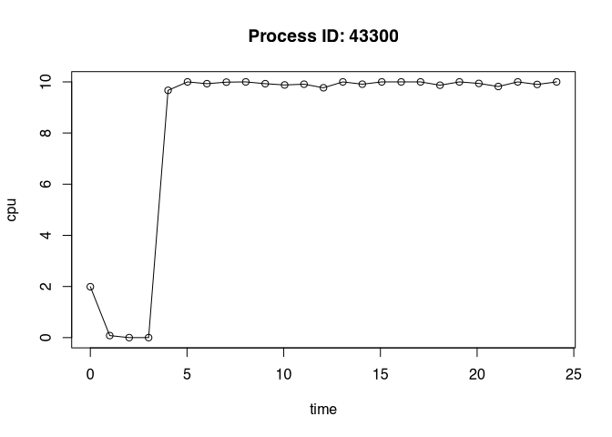
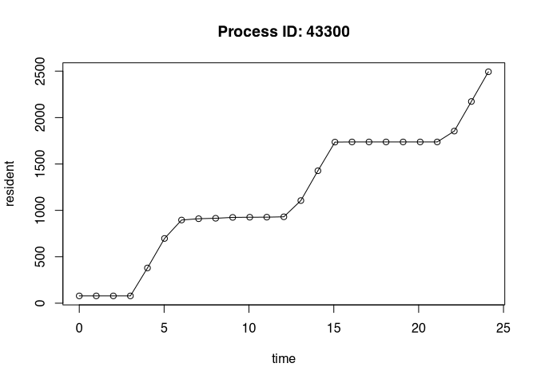

# autometric <a href="https://wlandau.github.io/autometric/"></a>

<!--
[](https://CRAN.R-project.org/package=autometric)
-->

[](https://www.repostatus.org/#active)
[](https://github.com/wlandau/autometric/actions?query=workflow%3Acheck)
[](https://app.codecov.io/gh/wlandau/autometric)
[](https://github.com/wlandau/autometric/actions?query=workflow%3Alint)
[](https://github.com/wlandau/autometric/actions?query=workflow%3Apkgdown)

Intense parallel workloads can be difficult to monitor. Packages
[`crew.cluster`](https://wlandau.github.io/crew.cluster/),
[`clustermq`](https://mschubert.github.io/clustermq/), and
[`future.batchtools`](https://future.batchtools.futureverse.org/)
distribute hundreds of worker processes over multiple computers. If a
worker process exhausts its available memory, it may terminate silently,
leaving the underlying problem difficult to detect or troubleshoot.
Using the `autometric` package, a worker can proactively monitor itself
in a detached POSIX thread. The worker process itself runs normally, and
the thread writes to a log every few seconds. If the worker terminates
unexpectedly, `autometric` can read and visualize the log file to reveal
potential resource-related reasons for the crash.

## Requirements

- A Linux, Mac OS, or Windows operating system.
- POSIX threads. Modern tool chains seem to provide R with POSIX thread
  support, even on Windows.
- Either POSIX timers or a Windows operating system.

## Installation

You can install the development version of `autometric` from
[GitHub](https://github.com/) with:

``` r
remotes::install_github("wlandau/autometric")
```

## Usage

The `log_start()` function in `autometric` starts a non-blocking POSIX
thread to write resource usage statistics to a log at periodic
intervals. The following example uses the
[`callr`](https://callr.r-lib.org/) R package to launch a
resource-intensive background process on a Unix-like system. The
`autometric` thread prints to standard output, and `callr` directs all
its standard output to a temporary text file we define in advance.[^1]

``` r
log_file <- tempfile()

process <- callr::r_bg(
  func = function() {
    print("Setting up the log.")
    autometric::log_start(
      path = "/dev/stdout",
      pids = c(my_worker = Sys.getpid()),
      seconds = 1
    )
    
    print("Warming up.")
    Sys.sleep(3)
    
    print("Defining a function that guzzles CPU power.")
    is_prime <- function(n) {
      if (n <= 1) return(FALSE)
      for (i in seq(2, sqrt(n))) {
        if (n %% i == 0) {
          return(FALSE)
        }
      }
      TRUE
    }
    
    print("Allocating a large object.")
    x <- rnorm(1e8)
    
    print("Guzzling CPU power.")
    lapply(seq_len(1e6), is_prime)
    
    print("Allocating another large object.")
    y <- rnorm(1e8)
    
    print("Guzzling more CPU.")
    lapply(seq_len(1e6), is_prime)
    
    print("Allocating a third large object.")
    z <- rnorm(1e8)
    
    print("Done.")
  },
  stdout = log_file
)
```

When we read in the log file, we see messages from both R and the
`autometric` thread.

``` r
writeLines(readLines(log_file))
#> [1] "Setting up the log."
#> [1] "Warming up."
#> __AUTOMETRIC__|0.0.4.9000|5212|my_worker|0|1728302986.989|0.900|0.090|77938688|420690477056|__AUTOMETRIC__
#> __AUTOMETRIC__|0.0.4.9000|5212|my_worker|0|1728302987.994|0.000|0.000|78004224|420699914240|__AUTOMETRIC__
#> [1] "Defining a function that guzzles CPU power."
#> [1] "Allocating a large object."
#> __AUTOMETRIC__|0.0.4.9000|5212|my_worker|0|1728302988.997|0.000|0.000|78053376|420708302848|__AUTOMETRIC__
#> __AUTOMETRIC__|0.0.4.9000|5212|my_worker|0|1728302990.002|95.800|9.580|385613824|421508333568|__AUTOMETRIC__
#> __AUTOMETRIC__|0.0.4.9000|5212|my_worker|0|1728302991.005|99.900|9.990|705708032|421508333568|__AUTOMETRIC__
#> [1] "Guzzling CPU power."
#> __AUTOMETRIC__|0.0.4.9000|5212|my_worker|0|1728302992.007|99.400|9.940|905494528|421533499392|__AUTOMETRIC__
#> __AUTOMETRIC__|0.0.4.9000|5212|my_worker|0|1728302993.012|100.000|10.000|915177472|421533499392|__AUTOMETRIC__
#> __AUTOMETRIC__|0.0.4.9000|5212|my_worker|0|1728302994.017|100.000|10.000|920846336|421533499392|__AUTOMETRIC__
#> __AUTOMETRIC__|0.0.4.9000|5212|my_worker|0|1728302995.022|98.800|9.880|920846336|421533499392|__AUTOMETRIC__
#> __AUTOMETRIC__|0.0.4.9000|5212|my_worker|0|1728302996.027|98.800|9.880|921862144|421533499392|__AUTOMETRIC__
#> __AUTOMETRIC__|0.0.4.9000|5212|my_worker|0|1728302997.033|99.700|9.970|925302784|421533499392|__AUTOMETRIC__
#> __AUTOMETRIC__|0.0.4.9000|5212|my_worker|0|1728302998.035|99.100|9.910|926695424|421541888000|__AUTOMETRIC__
#> [1] "Allocating another large object."
#> __AUTOMETRIC__|0.0.4.9000|5212|my_worker|0|1728302999.038|99.700|9.970|1150222336|422341902336|__AUTOMETRIC__
#> __AUTOMETRIC__|0.0.4.9000|5212|my_worker|0|1728303000.043|99.900|9.990|1470906368|422341902336|__AUTOMETRIC__
#> [1] "Guzzling more CPU."
#> __AUTOMETRIC__|0.0.4.9000|5212|my_worker|0|1728303001.048|100.000|10.000|1741717504|422341902336|__AUTOMETRIC__
#> __AUTOMETRIC__|0.0.4.9000|5212|my_worker|0|1728303002.053|98.400|9.840|1741717504|422341902336|__AUTOMETRIC__
#> __AUTOMETRIC__|0.0.4.9000|5212|my_worker|0|1728303003.058|100.000|10.000|1746960384|422341902336|__AUTOMETRIC__
#> __AUTOMETRIC__|0.0.4.9000|5212|my_worker|0|1728303004.063|100.000|10.000|1746993152|422341902336|__AUTOMETRIC__
#> __AUTOMETRIC__|0.0.4.9000|5212|my_worker|0|1728303005.068|100.000|10.000|1746993152|422341902336|__AUTOMETRIC__
#> __AUTOMETRIC__|0.0.4.9000|5212|my_worker|0|1728303006.074|99.600|9.960|1746993152|422341902336|__AUTOMETRIC__
#> __AUTOMETRIC__|0.0.4.9000|5212|my_worker|0|1728303007.079|100.000|10.000|1746993152|422341902336|__AUTOMETRIC__
#> [1] "Allocating a third large object."
#> __AUTOMETRIC__|0.0.4.9000|5212|my_worker|0|1728303008.084|98.600|9.860|1929740288|423141916672|__AUTOMETRIC__
#> __AUTOMETRIC__|0.0.4.9000|5212|my_worker|0|1728303009.087|100.000|10.000|1828651008|423141916672|__AUTOMETRIC__
#> [1] "Done."
```

`autometric` knows how to read its log entries even if the log file has
other messages. See the documentation of `log_read()` to learn how to
interpret the data and customize the measurement units.

``` r
library(autometric)
log_data <- log_read(log_file)

log_data
#>       version  pid      name status   time  core   cpu   resident  virtual
#> 1  0.0.4.9000 5212 my_worker      0  0.000   0.9  0.09   77.93869 420690.5
#> 2  0.0.4.9000 5212 my_worker      0  1.005   0.0  0.00   78.00422 420699.9
#> 3  0.0.4.9000 5212 my_worker      0  2.008   0.0  0.00   78.05338 420708.3
#> 4  0.0.4.9000 5212 my_worker      0  3.013  95.8  9.58  385.61382 421508.3
#> 5  0.0.4.9000 5212 my_worker      0  4.016  99.9  9.99  705.70803 421508.3
#> 6  0.0.4.9000 5212 my_worker      0  5.018  99.4  9.94  905.49453 421533.5
#> 7  0.0.4.9000 5212 my_worker      0  6.023 100.0 10.00  915.17747 421533.5
#> 8  0.0.4.9000 5212 my_worker      0  7.028 100.0 10.00  920.84634 421533.5
#> 9  0.0.4.9000 5212 my_worker      0  8.033  98.8  9.88  920.84634 421533.5
#> 10 0.0.4.9000 5212 my_worker      0  9.038  98.8  9.88  921.86214 421533.5
#> 11 0.0.4.9000 5212 my_worker      0 10.044  99.7  9.97  925.30278 421533.5
#> 12 0.0.4.9000 5212 my_worker      0 11.046  99.1  9.91  926.69542 421541.9
#> 13 0.0.4.9000 5212 my_worker      0 12.049  99.7  9.97 1150.22234 422341.9
#> 14 0.0.4.9000 5212 my_worker      0 13.054  99.9  9.99 1470.90637 422341.9
#> 15 0.0.4.9000 5212 my_worker      0 14.059 100.0 10.00 1741.71750 422341.9
#> 16 0.0.4.9000 5212 my_worker      0 15.064  98.4  9.84 1741.71750 422341.9
#> 17 0.0.4.9000 5212 my_worker      0 16.069 100.0 10.00 1746.96038 422341.9
#> 18 0.0.4.9000 5212 my_worker      0 17.074 100.0 10.00 1746.99315 422341.9
#> 19 0.0.4.9000 5212 my_worker      0 18.079 100.0 10.00 1746.99315 422341.9
#> 20 0.0.4.9000 5212 my_worker      0 19.085  99.6  9.96 1746.99315 422341.9
#> 21 0.0.4.9000 5212 my_worker      0 20.090 100.0 10.00 1746.99315 422341.9
#> 22 0.0.4.9000 5212 my_worker      0 21.095  98.6  9.86 1929.74029 423141.9
#> 23 0.0.4.9000 5212 my_worker      0 22.098 100.0 10.00 1828.65101 423141.9
```

`autometric` also supports simple visualizations plot performance
metrics over time. To avoid depending on many other R packages,
`autometric` only uses base plotting functionality. Feel free to create
fancier visualizations directly with
[`ggplot2`](https://ggplot2.tidyverse.org/).

``` r
log_plot(log_data, metric = "cpu")
```



``` r
log_plot(log_data, metric = "resident")
```



## Attribution

`autometric` heavily leverages fantastic work on the
[`ps`](https://ps.r-lib.org/) R package by Jay Loden, Dave Daeschler,
Giampaolo Rodola, Gábor Csárdi, and Posit Software, PBC. The source code
of [`ps`](https://ps.r-lib.org/) was especially helpful for identifying
appropriate system calls to retrieve resource usage statistics.
Attribution is given in the `Authors@R` field of the `DESCRIPTION` file,
the `LICENSE.note` file at the top level of the package, and in the
comments of the C files in `src/`. Please visit
<https://github.com/r-lib/ps/blob/main/LICENSE.md> to view the license
of [`ps`](https://ps.r-lib.org/). [`ps`](https://ps.r-lib.org/) in turn
is based on [`psutil`](https://github.com/giampaolo/psutil), whose
license is available at
<https://github.com/giampaolo/psutil/blob/master/LICENSE>.

## Code of Conduct

Please note that the `autometric` project is released with a
[Contributor Code of
Conduct](https://contributor-covenant.org/version/2/1/CODE_OF_CONDUCT.html).
By contributing to this project, you agree to abide by its terms.

[^1]: Logging to standard output is useful on clusters like SLURM where
    workers already redirect standard output to log files, or on the
    cloud where a service like [Amazon
    CloudWatch](https://aws.amazon.com/cloudwatch/) captures messages
    instead of directing them to a physical file.
