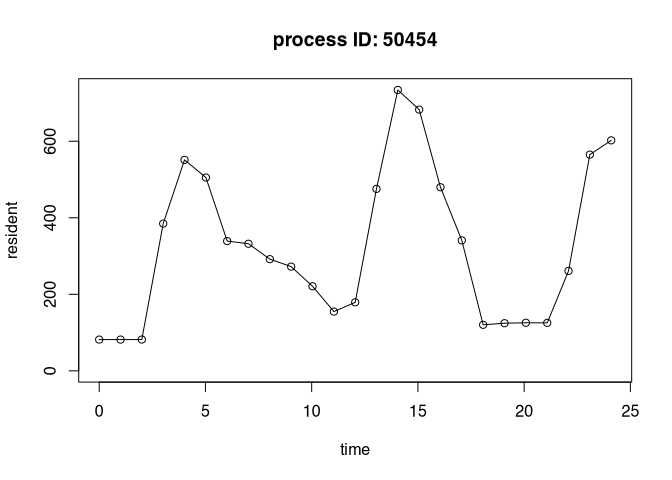
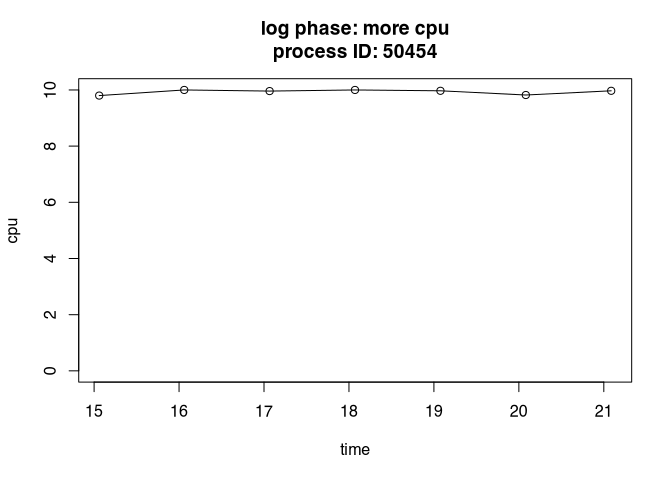

# autometric <a href="https://wlandau.github.io/autometric/"></a>

[](https://CRAN.R-project.org/package=autometric)
[](https://www.repostatus.org/#active)
[](https://github.com/wlandau/autometric/actions?query=workflow%3Acheck)
[](https://app.codecov.io/gh/wlandau/autometric)
[](https://github.com/wlandau/autometric/actions?query=workflow%3Alint)
[](https://github.com/wlandau/autometric/actions?query=workflow%3Apkgdown)

Intense parallel workloads can be difficult to monitor. Packages
[`crew.cluster`](https://wlandau.github.io/crew.cluster/),
[`clustermq`](https://mschubert.github.io/clustermq/), and
[`future.batchtools`](https://future.batchtools.futureverse.org/)
distribute hundreds of worker processes over multiple computers. If a
worker process exhausts its available memory, it may terminate silently,
leaving the underlying problem difficult to detect or troubleshoot.
Using the `autometric` package, a worker can proactively monitor itself
in a detached POSIX thread. The worker process itself runs normally, and
the thread writes to a log every few seconds. If the worker terminates
unexpectedly, `autometric` can read and visualize the log file to reveal
potential resource-related reasons for the crash.

## Requirements

- A Linux, Mac OS, or Windows operating system.
- POSIX threads. Modern tool chains seem to provide R with POSIX thread
  support, even on Windows.
- Either POSIX timers or a Windows operating system.

## Installation

You can install the development version of `autometric` from
[GitHub](https://github.com/) with:

``` r
remotes::install_github("wlandau/autometric")
```

## Usage

The `log_start()` function in `autometric` starts a non-blocking POSIX
thread to write resource usage statistics to a log at periodic
intervals. The following example uses the
[`callr`](https://callr.r-lib.org/) R package to launch a
resource-intensive background process on a Unix-like system. The
`autometric` thread prints to standard output, and `callr` directs all
its standard output to a temporary text file we define in advance.[^1]
Custom calls to `log_phase_set()` annotate the log data[^2].

``` r
log_file <- tempfile()

process <- callr::r_bg(
  func = function() {
    library(autometric)
    log_phase_set("setup")
    log_start(
      path = "/dev/stdout",
      pids = c(my_worker = Sys.getpid()),
      seconds = 1
    )
    
    log_phase_set("warmup")
    Sys.sleep(3)
    
    print("You can mix printed messages with regular log data.")
    
    print("Defining a function that guzzles CPU power.")
    is_prime <- function(n) {
      if (n <= 1) return(FALSE)
      for (i in seq(2, sqrt(n))) {
        if (n %% i == 0) {
          return(FALSE)
        }
      }
      TRUE
    }
    
    log_phase_set("large object")
    x <- rnorm(1e8)
    
    log_phase_set("heavy cpu")
    lapply(seq_len(1e6), is_prime)
    
    log_phase_set("another object")
    y <- rnorm(1e8)
    
    log_phase_set("more cpu")
    lapply(seq_len(1e6), is_prime)
    
    log_phase_set("third object")
    z <- rnorm(1e8)
    
    log_phase_set("done")
  },
  stdout = log_file
)
```

When we read in the log file, we see messages from both R and the
`autometric` thread.

``` r
writeLines(readLines(log_file))
#> __AUTOMETRIC__|0.0.5.9001|9967|my_worker|0|1729522150.260|1.000|0.100|77496320|420432527360|warmup|__AUTOMETRIC__
#> __AUTOMETRIC__|0.0.5.9001|9967|my_worker|0|1729522151.265|0.000|0.000|77496320|420432527360|warmup|__AUTOMETRIC__
#> [1] "You can mix printed messages with regular log data."
#> [1] "Defining a function that guzzles CPU power."
#> __AUTOMETRIC__|0.0.5.9001|9967|my_worker|0|1729522152.267|0.000|0.000|77676544|420441964544|large object|__AUTOMETRIC__
#> __AUTOMETRIC__|0.0.5.9001|9967|my_worker|0|1729522153.273|98.400|9.840|387760128|421250383872|large object|__AUTOMETRIC__
#> __AUTOMETRIC__|0.0.5.9001|9967|my_worker|0|1729522154.278|100.000|10.000|709951488|421250383872|large object|__AUTOMETRIC__
#> __AUTOMETRIC__|0.0.5.9001|9967|my_worker|0|1729522155.283|100.000|10.000|901480448|421267161088|heavy cpu|__AUTOMETRIC__
#> __AUTOMETRIC__|0.0.5.9001|9967|my_worker|0|1729522156.288|99.000|9.900|909869056|421267161088|heavy cpu|__AUTOMETRIC__
#> __AUTOMETRIC__|0.0.5.9001|9967|my_worker|0|1729522157.293|100.000|10.000|914243584|421267161088|heavy cpu|__AUTOMETRIC__
#> __AUTOMETRIC__|0.0.5.9001|9967|my_worker|0|1729522158.299|99.400|9.940|921550848|421267161088|heavy cpu|__AUTOMETRIC__
#> __AUTOMETRIC__|0.0.5.9001|9967|my_worker|0|1729522159.304|100.000|10.000|921550848|421267161088|heavy cpu|__AUTOMETRIC__
#> __AUTOMETRIC__|0.0.5.9001|9967|my_worker|0|1729522160.309|98.800|9.880|925564928|421267161088|heavy cpu|__AUTOMETRIC__
#> __AUTOMETRIC__|0.0.5.9001|9967|my_worker|0|1729522161.310|100.000|10.000|925597696|421267161088|heavy cpu|__AUTOMETRIC__
#> __AUTOMETRIC__|0.0.5.9001|9967|my_worker|0|1729522162.315|100.000|10.000|1194868736|422067175424|another object|__AUTOMETRIC__
#> __AUTOMETRIC__|0.0.5.9001|9967|my_worker|0|1729522163.320|100.000|10.000|1520173056|422067175424|another object|__AUTOMETRIC__
#> __AUTOMETRIC__|0.0.5.9001|9967|my_worker|0|1729522164.325|99.200|9.920|1733591040|422067175424|more cpu|__AUTOMETRIC__
#> __AUTOMETRIC__|0.0.5.9001|9967|my_worker|0|1729522165.326|99.500|9.950|1736572928|422067175424|more cpu|__AUTOMETRIC__
#> __AUTOMETRIC__|0.0.5.9001|9967|my_worker|0|1729522166.331|98.900|9.890|1736572928|422067175424|more cpu|__AUTOMETRIC__
#> __AUTOMETRIC__|0.0.5.9001|9967|my_worker|0|1729522167.337|99.100|9.910|1736589312|422067175424|more cpu|__AUTOMETRIC__
#> __AUTOMETRIC__|0.0.5.9001|9967|my_worker|0|1729522168.342|100.000|10.000|1737736192|422075564032|more cpu|__AUTOMETRIC__
#> __AUTOMETRIC__|0.0.5.9001|9967|my_worker|0|1729522169.345|99.000|9.900|1744994304|422075564032|more cpu|__AUTOMETRIC__
#> __AUTOMETRIC__|0.0.5.9001|9967|my_worker|0|1729522170.350|98.800|9.880|1744994304|422075564032|more cpu|__AUTOMETRIC__
#> __AUTOMETRIC__|0.0.5.9001|9967|my_worker|0|1729522171.355|99.600|9.960|1982660608|422875578368|third object|__AUTOMETRIC__
#> __AUTOMETRIC__|0.0.5.9001|9967|my_worker|0|1729522172.360|98.300|9.830|2297184256|422875578368|third object|__AUTOMETRIC__
```

`autometric` knows how to read its log entries even if the log file has
other messages. See the documentation of `log_read()` to learn how to
interpret the data and customize the measurement units.

``` r
library(autometric)
log_data <- log_read(log_file)

log_data
#>       version          phase  pid      name status   time  core   cpu
#> 1  0.0.5.9001         warmup 9967 my_worker      0  0.000   1.0  0.10
#> 2  0.0.5.9001         warmup 9967 my_worker      0  1.005   0.0  0.00
#> 3  0.0.5.9001   large object 9967 my_worker      0  2.007   0.0  0.00
#> 4  0.0.5.9001   large object 9967 my_worker      0  3.013  98.4  9.84
#> 5  0.0.5.9001   large object 9967 my_worker      0  4.018 100.0 10.00
#> 6  0.0.5.9001      heavy cpu 9967 my_worker      0  5.023 100.0 10.00
#> 7  0.0.5.9001      heavy cpu 9967 my_worker      0  6.028  99.0  9.90
#> 8  0.0.5.9001      heavy cpu 9967 my_worker      0  7.033 100.0 10.00
#> 9  0.0.5.9001      heavy cpu 9967 my_worker      0  8.039  99.4  9.94
#> 10 0.0.5.9001      heavy cpu 9967 my_worker      0  9.044 100.0 10.00
#> 11 0.0.5.9001      heavy cpu 9967 my_worker      0 10.049  98.8  9.88
#> 12 0.0.5.9001      heavy cpu 9967 my_worker      0 11.050 100.0 10.00
#> 13 0.0.5.9001 another object 9967 my_worker      0 12.055 100.0 10.00
#> 14 0.0.5.9001 another object 9967 my_worker      0 13.060 100.0 10.00
#> 15 0.0.5.9001       more cpu 9967 my_worker      0 14.065  99.2  9.92
#> 16 0.0.5.9001       more cpu 9967 my_worker      0 15.066  99.5  9.95
#> 17 0.0.5.9001       more cpu 9967 my_worker      0 16.071  98.9  9.89
#> 18 0.0.5.9001       more cpu 9967 my_worker      0 17.077  99.1  9.91
#> 19 0.0.5.9001       more cpu 9967 my_worker      0 18.082 100.0 10.00
#> 20 0.0.5.9001       more cpu 9967 my_worker      0 19.085  99.0  9.90
#> 21 0.0.5.9001       more cpu 9967 my_worker      0 20.090  98.8  9.88
#> 22 0.0.5.9001   third object 9967 my_worker      0 21.095  99.6  9.96
#> 23 0.0.5.9001   third object 9967 my_worker      0 22.100  98.3  9.83
#>      resident  virtual
#> 1    77.49632 420432.5
#> 2    77.49632 420432.5
#> 3    77.67654 420442.0
#> 4   387.76013 421250.4
#> 5   709.95149 421250.4
#> 6   901.48045 421267.2
#> 7   909.86906 421267.2
#> 8   914.24358 421267.2
#> 9   921.55085 421267.2
#> 10  921.55085 421267.2
#> 11  925.56493 421267.2
#> 12  925.59770 421267.2
#> 13 1194.86874 422067.2
#> 14 1520.17306 422067.2
#> 15 1733.59104 422067.2
#> 16 1736.57293 422067.2
#> 17 1736.57293 422067.2
#> 18 1736.58931 422067.2
#> 19 1737.73619 422075.6
#> 20 1744.99430 422075.6
#> 21 1744.99430 422075.6
#> 22 1982.66061 422875.6
#> 23 2297.18426 422875.6
```

`autometric` also supports simple visualizations plot performance
metrics over time. To avoid depending on many other R packages,
`autometric` only uses base plotting functionality. Feel free to create
fancier visualizations directly with
[`ggplot2`](https://ggplot2.tidyverse.org/).

``` r
log_plot(log_data, metric = "resident")
```



``` r
log_plot(log_data, phase = "more cpu", metric = "cpu")
```



## Attribution

`autometric` heavily leverages fantastic work on the
[`ps`](https://ps.r-lib.org/) R package by Jay Loden, Dave Daeschler,
Giampaolo Rodola, Gábor Csárdi, and Posit Software, PBC. The source code
of [`ps`](https://ps.r-lib.org/) was especially helpful for identifying
appropriate system calls to retrieve resource usage statistics.
Attribution is given in the `Authors@R` field of the `DESCRIPTION` file,
the `LICENSE.note` file at the top level of the package, and in the
comments of the C files in `src/`. Please visit
<https://github.com/r-lib/ps/blob/main/LICENSE.md> to view the license
of [`ps`](https://ps.r-lib.org/). [`ps`](https://ps.r-lib.org/) in turn
is based on [`psutil`](https://github.com/giampaolo/psutil), whose
license is available at
<https://github.com/giampaolo/psutil/blob/master/LICENSE>.

## Code of Conduct

Please note that the `autometric` project is released with a
[Contributor Code of
Conduct](https://contributor-covenant.org/version/2/1/CODE_OF_CONDUCT.html).
By contributing to this project, you agree to abide by its terms.

[^1]: Logging to standard output is useful on clusters like SLURM where
    workers already redirect standard output to log files, or on the
    cloud where a service like [Amazon
    CloudWatch](https://aws.amazon.com/cloudwatch/) captures messages
    instead of directing them to a physical file.

[^2]: See also `log_phase_get()` and `log_phase_reset()`
